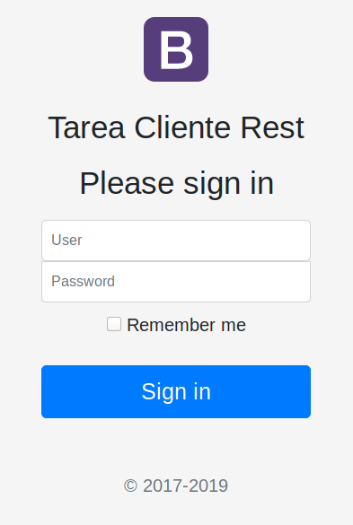
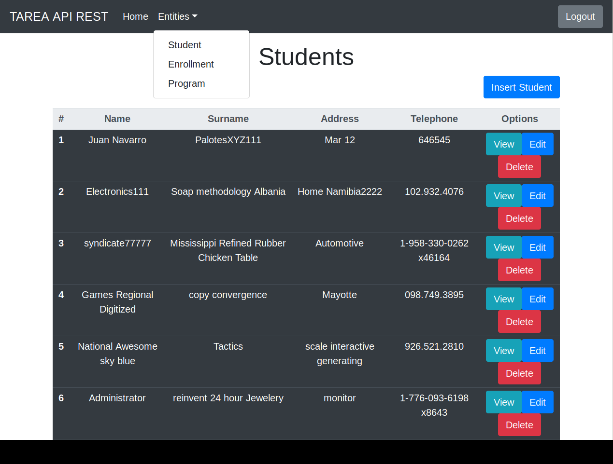

# Proyecto Rest Enrollment Client

Autor: Navarro Arias, Juan Dirceu.  
Modulo: Consumo de APIs.  
Universidad Andina Simón Bolivar.  
Sede Sucre, Bolivia.

## Descripción.

Cliente que consume los servicios _REST_ para matricular estudiantes (enrollment) del proyecto [rest_enrollment_server](https://github.com/georgeguitar/rest_enrollment_server.git)

El proyecto está relacionado con el proyecto [SOAP](https://github.com/georgeguitar/soap_enrollment_server.git)

## Base de datos.
El cliente trabaja sobre la base de datos ser servidor, como se ve en la imagen.  

Tablas:  
- Student.  
- Progrma.  
- Enrollment.  

## Herramientas utilizadas.

Sistema operativo: Debian 10 con Gnome  
IDE: Eclipse v4.12.0  
Servidor REST: [jHipster](https://www.jhipster.tech/). v6.1.2
Navegador web: Firefox 60.8.0esr  
Lenguaje de desarrollo: PHP v7.3 con Guzzle. 

## Para utilizar el cliente.

Se debe desplegar el cliente en un servidor apache con php.

La URL de acceso al cliente es: [http://uasb-api.rootcode.com.bo/jnavarro/rest-enrollment-client/](http://uasb-api.rootcode.com.bo/jnavarro/rest-enrollment-client/)

Cuando se accede se mostrará la siguiente pantalla.  

Los usuarios disponibles son:  
- Usuario: admin, pw: admin  
- Usuario: user, pw: user  

## Servicios para consumir.

Los servicios se puede consumir el cliente se encuentran desplegados en el menú Entities: Student, Enrollment y Program, como se muestra en siguiente pantalla:

